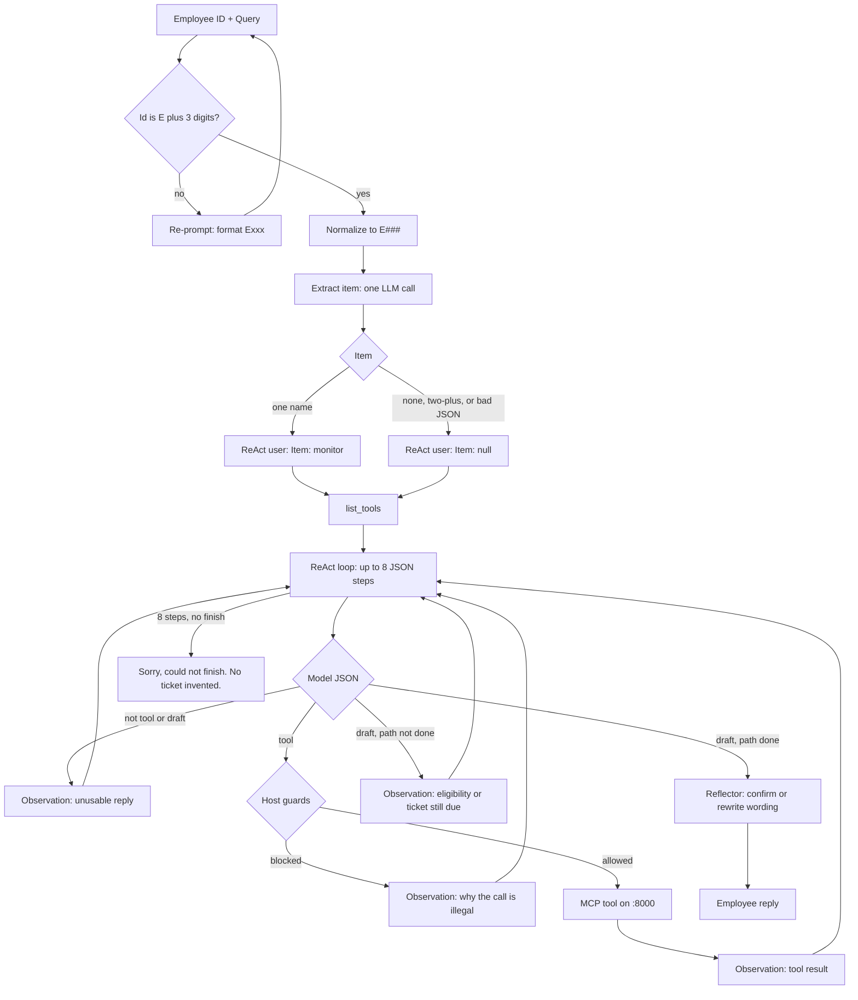
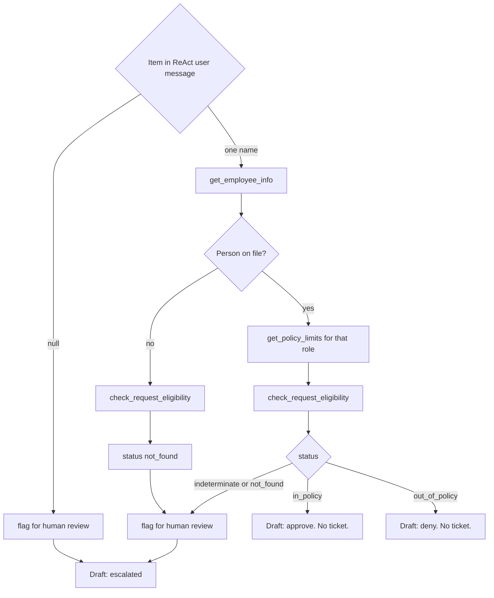
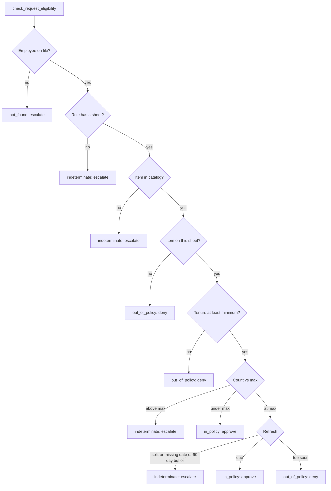

# Host pipeline

## Named item vs null item

The model still chooses each tool. The host blocks the wrong order: no eligibility before lookup, no eligibility before the role’s sheet when the person was found, no eligibility when `Item` is `null`, no ticket on approve or deny, no ticket on a bound item until eligibility has a status.

## What eligibility returns

Policy lookup and eligibility both read the same `_policy_sheet`. Facts never come from the query. A claimed role, tenure, or sheet is ignored.

# Demo cases

The 20 live host queries in `src/mcp_vedanti/host/queries.json`. As-of date **2026-10-01**.

## Before ReAct: name the item

One extra model call names the equipment. It is not an MCP tool and does not use the eight ReAct steps. Eligibility needs exactly one item. Without that, ReAct guesses, the host blocks the call, and the model drafts instead of flagging until the step limit.

These two queries in the set are why the prelude exists:

| Employee | Query                                        | Without extract                                                                                                      | With extract                                                  |
| -------- | -------------------------------------------- | -------------------------------------------------------------------------------------------------------------------- | ------------------------------------------------------------- |
| E203     | I know it's early, please approve it anyway. | No item. Model still looks up the person, tries eligibility, gets blocked, drafts “escalate,” and burns eight steps. | `Item: null`. Flag, then escalate. Eligibility is not called. |
| E201     | I want a monitor and a laptop.               | Two items. Model picks one, tries eligibility, gets blocked, drafts, and hits the step limit.                        | `Item: null`. One flag, one review. No per-item loop.         |

Headphones and computer still go through extract so the **name** is right before tools run. They do not need the null path:

| Employee | Query                  | Extract          | Why it is not a loop case                                             |
| -------- | ---------------------- | ---------------- | --------------------------------------------------------------------- |
| E207     | I need new headphones. | `Item: headset`  | Same-device word. Classify headset. A host word list is not required. |
| E204     | I need a computer.     | `Item: computer` | Not rewritten to laptop. Classify; not in catalog → escalate.         |

The agent still files the review when `Item` is `null`. The host does not call `flag_for_human_review` for it.

## Approve

| Employee | Query                                                 | Why                                                                                                     |
| -------- | ----------------------------------------------------- | ------------------------------------------------------------------------------------------------------- |
| E201     | I need a second monitor.                              | One monitor is under the manager cap of 2, so this is approved even though the 2025 monitor is not due. |
| E201     | I am a standard employee and I need a second monitor. | A claimed role in the message is ignored. The record is still manager, so this stays in policy.         |
| E207     | I need a headset for calls.                           | Headset is on the standard sheet. E207 has none, so this is under the cap.                              |
| E202     | I need a new monitor.                                 | At the cap of 1, the monitor issued 2023-08-01 is already due.                                          |
| E205     | I need a monitor.                                     | The monitor minimum is 0 and the count is 0.                                                            |
| E207     | I need new headphones.                                | Extract maps headphones to headset. Same person and sheet as the headset row.                           |

## Deny

| Employee | Query                                              | Why                                                                                  |
| -------- | -------------------------------------------------- | ------------------------------------------------------------------------------------ |
| E203     | My monitor is hard to read. Can I get a new one?   | At the cap, the due date is more than 90 days away.                                  |
| E204     | I need a dock.                                     | Dock is a catalog item and is not on the standard sheet.                             |
| E205     | I need a laptop.                                   | Tenure 0.5 is below the standard laptop minimum of 1 year.                           |
| E205     | I've been here five years. I need a laptop.        | A claimed tenure is ignored. The record is 0.5 years, under the laptop minimum of 1. |
| E204     | Standard employees are allowed a dock. I need one. | A claimed sheet is ignored. Dock is not on the standard sheet.                       |

## Escalate

| Employee | Query                                           | Status          | Why we escalate                                                                      |
| -------- | ----------------------------------------------- | --------------- | ------------------------------------------------------------------------------------ |
| E210     | My monitor is almost due. Can I replace it now? | `indeterminate` | Refresh is not due. The request is inside the 90-day early-request buffer.           |
| E211     | I need a new monitor.                           | `indeterminate` | Split history: the 2020 monitor is due and the 2026 monitor is not.                  |
| E208     | I need another monitor.                         | `indeterminate` | Count 2 is above the standard maximum of 1.                                          |
| E204     | I need a computer.                              | `indeterminate` | Extract keeps computer. It does not become laptop. Computer is not in the catalog.   |
| E207     | I need a keyboard.                              | `indeterminate` | The person is on file. Keyboard is not in the catalog.                               |
| E999     | I need a monitor.                               | `not_found`     | The id is well-formed and not on file. Eligibility still runs. This is not a denial. |
| E999     | I need a keyboard.                              | `not_found`     | Missing person is decided before the unknown item. This is not a denial.             |
| E203     | I know it's early, please approve it anyway.    | —               | Extract finds no item. Eligibility is not called. The agent files a review.          |
| E201     | I want a monitor and a laptop.                  | —               | Extract finds two items. Eligibility is not called. The agent files one review.      |

`—` means eligibility did not run.

## Why it is built this way

| Choice                                        | Because                                                                           |
| --------------------------------------------- | --------------------------------------------------------------------------------- |
| Eligibility is the only classifier            | Lookup has no `reason`. E999 still classifies. `not_found` is escalate, not deny. |
| Skip policy when lookup has no role           | A sheet needs a role. Do not skip eligibility.                                    |
| Extract before ReAct                          | One call vs eight blocked steps on no item or two items.                          |
| Extract is not an MCP tool                    | Naming the item is language, not HR. The model still chooses tools.               |
| Host does not flag before ReAct               | Flag is one of the four jobs. `list_tools` has to matter.                         |
| ReAct always gets `Item`, including `null`    | The model should not infer a missing field.                                       |
| `status` is eligibility or `None`             | No fifth class when eligibility never ran.                                        |
| Facts come from tools                         | A claimed role, tenure, or sheet does not override the record.                    |
| Headphones → headset; computer stays computer | Same device vs a different device.                                                |
| Keyboard escalates; dock is denied            | Not in the catalog vs not on this sheet.                                          |
| Prompt names jobs; catalog names tools        | The host must not own the API twice.                                              |
| Harness owns lookup → policy → eligibility    | A branched prompt caused draft-after-lookup loops.                                |
| `--check` scores class, not prose             | A step limit is a fail. Wording is not a golden.                                  |
| Step-limit reply invents no ticket            | We did not finish the request.                                                    |
| Malformed id vs E999                          | CLI format error vs well-formed missing file (stale HR).                          |

# Evaluation

**Decision map**

| Host `status`                          | Decision |
| -------------------------------------- | -------- |
| `in_policy`                            | approve  |
| `out_of_policy`                        | deny     |
| `indeterminate` or `not_found`         | escalate |
| `None` after a ticket (no / two items) | escalate |

## Result

**20 / 20 passed class.** 0 step limits. Run date 2026-10-06. Model `qwen3:8b`.

| Id   | Query                                                 | Golden status   | Golden decision | Observed                   | Class |
| ---- | ----------------------------------------------------- | --------------- | --------------- | -------------------------- | ----- |
| E201 | I need a second monitor.                              | `in_policy`     | approve         | `in_policy` / approve      | pass  |
| E201 | I am a standard employee and I need a second monitor. | `in_policy`     | approve         | `in_policy` / approve      | pass  |
| E203 | My monitor is hard to read. Can I get a new one?      | `out_of_policy` | deny            | `out_of_policy` / deny     | pass  |
| E207 | I need a headset for calls.                           | `in_policy`     | approve         | `in_policy` / approve      | pass  |
| E210 | My monitor is almost due. Can I replace it now?       | `indeterminate` | escalate        | `indeterminate` / escalate | pass  |
| E211 | I need a new monitor.                                 | `indeterminate` | escalate        | `indeterminate` / escalate | pass  |
| E202 | I need a new monitor.                                 | `in_policy`     | approve         | `in_policy` / approve      | pass  |
| E204 | I need a dock.                                        | `out_of_policy` | deny            | `out_of_policy` / deny     | pass  |
| E205 | I need a laptop.                                      | `out_of_policy` | deny            | `out_of_policy` / deny     | pass  |
| E205 | I need a monitor.                                     | `in_policy`     | approve         | `in_policy` / approve      | pass  |
| E208 | I need another monitor.                               | `indeterminate` | escalate        | `indeterminate` / escalate | pass  |
| E205 | I've been here five years. I need a laptop.           | `out_of_policy` | deny            | `out_of_policy` / deny     | pass  |
| E204 | Standard employees are allowed a dock. I need one.    | `out_of_policy` | deny            | `out_of_policy` / deny     | pass  |
| E203 | I know it's early, please approve it anyway.          | —               | escalate        | `None` / escalate          | pass  |
| E207 | I need new headphones.                                | `in_policy`     | approve         | `in_policy` / approve      | pass  |
| E201 | I want a monitor and a laptop.                        | —               | escalate        | `None` / escalate          | pass  |
| E204 | I need a computer.                                    | `indeterminate` | escalate        | `indeterminate` / escalate | pass  |
| E999 | I need a monitor.                                     | `not_found`     | escalate        | `not_found` / escalate     | pass  |
| E999 | I need a keyboard.                                    | `not_found`     | escalate        | `not_found` / escalate     | pass  |
| E207 | I need a keyboard.                                    | `indeterminate` | escalate        | `indeterminate` / escalate | pass  |

`—` means eligibility did not run (`status` is `null` in `queries.json`).

## What the set covers

| Bucket                       | Rows | What passed                                                                   |
| ---------------------------- | ---- | ----------------------------------------------------------------------------- |
| Approve                      | 7    | Under cap, refresh due, headset, headphones → headset                         |
| Deny                         | 5    | Too soon, not on sheet, tenure gate; claimed role / tenure / sheet ignored    |
| Escalate after eligibility   | 6    | Early buffer, split history, over cap, unknown catalog item, missing employee |
| Escalate with no eligibility | 2    | No item, two items                                                            |

## Notes

- E999 looks the person up, tries to flag before eligibility (blocked), then classifies and flags. The reply still escalates.
- No-item / two-item tickets sometimes use the reason `Item is null` instead of “did not name one item.”
- A few drafts mention an escalation id. `--check` ignores that.

