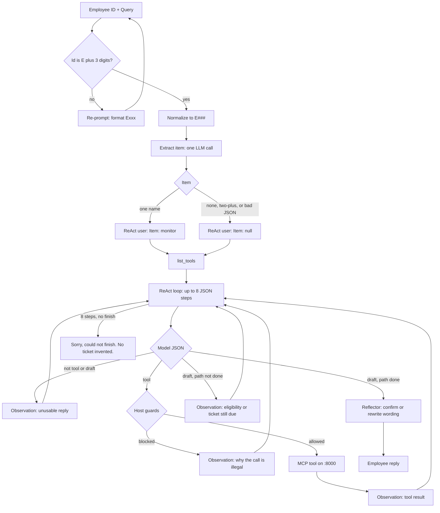
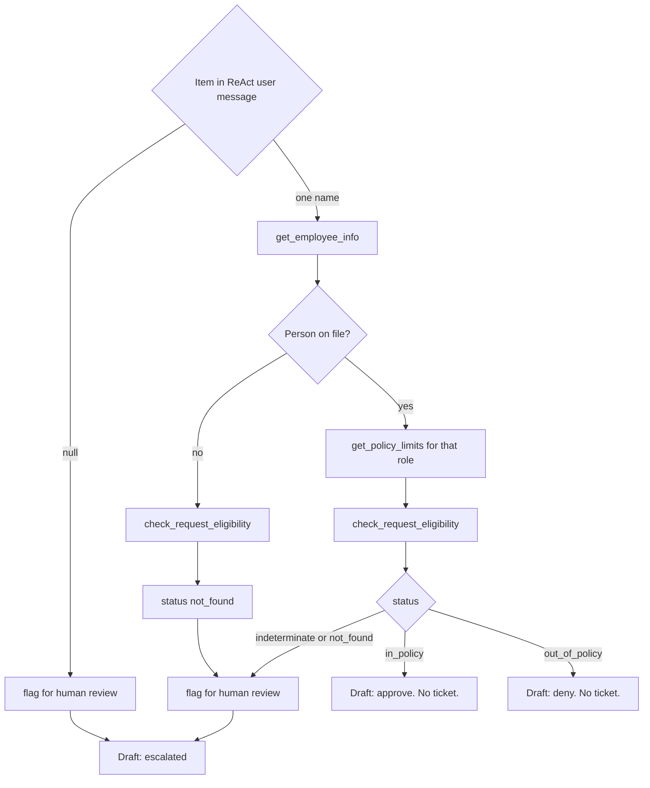
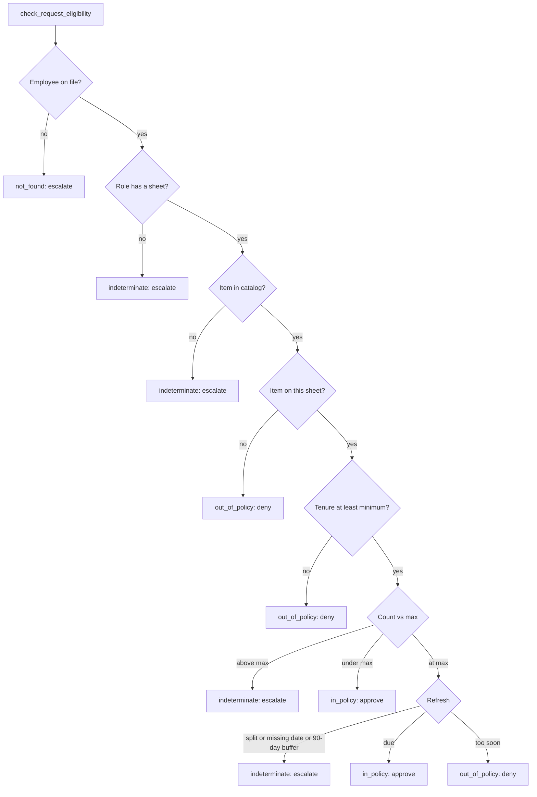

# Request flow

End-to-end path of one employee id and query. The server classifies. The host talks to the employee and follows that class.

## Host pipeline

## Named item vs null item

The model still chooses each tool. The host blocks the wrong order: no eligibility before lookup, no eligibility before the role’s sheet when the person was found, no eligibility when `Item` is `null`, no ticket on approve or deny, no ticket on a bound item until eligibility has a status.

## What eligibility returns

Policy lookup and eligibility both read the same `_policy_sheet`. Facts never come from the query. A claimed role, tenure, or sheet is ignored.

## After a legal draft

The reflector sees observations and the draft, not the agent’s thoughts. It may confirm the draft or rewrite the wording. It must not change approve / deny / escalate.

`--queries --check` scores the class (`status` + decision) against `queries.json`. It does not score prose. Traces go to `runs/` or `--run-dir`.
